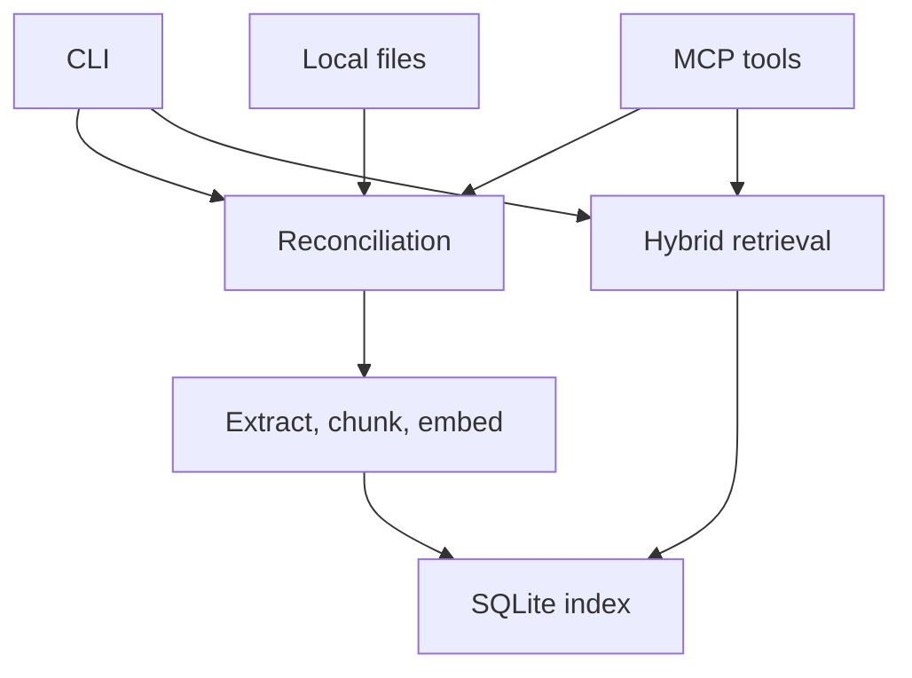

# Architecture

Chiedi is one Go executable with two entry points: terminal commands and MCP
stdio. Both use the same indexing, retrieval, and SQLite layers.

[Documentation index](README.md)

## Runtime structure

- **Indexing:** scans roots, extracts changed files, reuses compatible embeddings,
  and commits document replacements.
- **Retrieval:** embeds a question, reads lexical/vector candidates in one database
  snapshot, and fuses their ranks.
- **MCP:** reconciles before every supported tool, then returns evidence or index state.
- **Runtime services:** no HTTP listener, filesystem watcher, model server, or answer
  generator. CLI search and MCP tool calls trigger refresh work themselves.
- **PDFs:** bundled PDFium runs through WebAssembly; optional Tesseract is a local
  subprocess for OCR.

The diagram shows subsystem dependencies, not a transaction covering the whole
pipeline. Reconciliation writes documents individually; a retrieval snapshot
protects database evidence consistency, not a frozen view of the filesystem.

## Source map

| Package | Responsibility |
| --- | --- |
| [`cmd/chiedi`](../cmd/chiedi/main.go) | Process entry and interrupt cancellation |
| [`internal/app`](../internal/app/app.go) | CLI arguments and component wiring |
| [`internal/source`](../internal/source/open.go) | Open regular source files; nonblocking open flags on Unix |
| [`internal/extract`](../internal/extract/extract.go) | TXT/Markdown sections and PDF/OCR conversion |
| [`internal/chunk`](../internal/chunk/chunk.go) | Bounded chunks, provenance, and embedding-input hashes |
| [`internal/embedding`](../internal/embedding/embedding.go) | Embedder interface and deterministic projection |
| [`internal/indexer`](../internal/indexer/indexer.go) | Reconciliation, change detection, and reuse |
| [`internal/store`](../internal/store/store.go) | SQLite schema, atomic mutations, FTS, vectors, and evidence reads |
| [`internal/retrieval`](../internal/retrieval/retrieval.go) | Query preparation and rank fusion |
| [`internal/mcp`](../internal/mcp/server.go) | JSON-RPC framing and tool contracts |
| [`internal/e2e`](../internal/e2e/e2e_test.go) | Compiled-binary acceptance tests |
| [`benchmarks/search`](../benchmarks/search/main.go) | Opt-in performance and accuracy measurements |

## Design boundaries

- **Evidence identity:** root plus relative path disambiguates sources; chunk IDs
  identify a particular stored passage. Replacements allocate new chunk IDs.
- **Consistency:** metadata, chunk text, FTS rows, and vectors change together for
  each document replacement. See [storage](storage.md).
- **Incremental work:** unchanged files avoid extraction; unchanged embedding
  inputs within a changed document reuse vectors. See [indexing](indexing.md).
- **Local processing:** document parsing and retrieval need no network. An MCP host
  receives the returned text and has its own data-handling policy.

## Extending the implementation

These are code extension points, not runtime plugin settings:

- Replace `embedding.Embedder` (`ID`, `Dimensions`, `Embed`) and update component
  wiring. A changed embedding identity/dimension requires a compatible fresh index.
- Add formats in both extraction dispatch and the indexer's extension allowlist;
  preserve heading/page provenance and bounded reads.
- Change retrieval scoring in `internal/retrieval`, then check relevance and
  performance independently with the [benchmark](benchmarks.md).
- Update both MCP definitions and argument handling when adding a tool or field.

Follow [development rules and verification](testing.md) for any behavior change.
