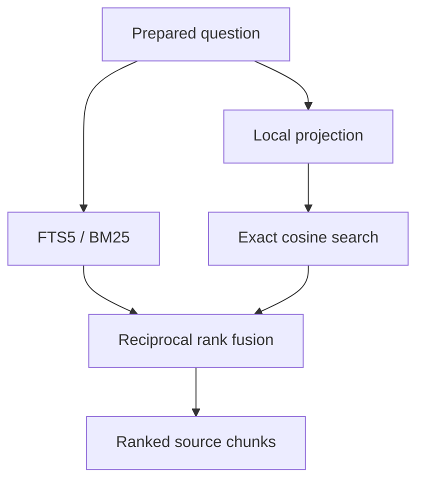

# Retrieval algorithms

Hybrid retrieval combines two useful signals: words that match the question and
passages with similar projected features. It returns ranked source chunks, not a
generated answer or a calibrated confidence score.

[Documentation index](README.md)

## Query to evidence



- CLI search and MCP tools reconcile roots first. `Retriever.Retrieve` itself
  does not scan files; internal callers control refresh explicitly.
- Lowercase and tokenize the question into Unicode letter/number sequences,
  remove a fixed English stopword list, and fall back to the original question
  if no terms remain. Stored document embeddings do not use this query filter.
- Read up to **40 vector candidates** and **40 lexical candidates** from one SQLite
  read snapshot. Their union can contain up to 80 chunks.
- Fuse ranks and return the requested number of chunks: default 10, maximum 50.
  Several chunks can come from one document; production retrieval does not deduplicate documents.

## Deterministic embedding projection

The built-in model is `builtin-semantic-projection-en-v2`, with **384 float32
coordinates**. It uses signed feature hashing; no learned weights are involved.

1. Lowercase and split on characters that are neither Unicode letters nor numbers.
2. For each token, add a `word:<token>` feature with weight **1**.
3. Canonicalize through the curated synonym dictionary first (for example,
   `configure` → `setup`). Otherwise strip the first matching suffix from
   `ingly`, `edly`, `ing`, `ed`, `es`, `s`, provided more than three bytes remain.
4. Add a canonical concept feature with weight **1.7**. Recognized dictionary
   entries or changed stems use five namespaces (`concept`, `meaning`, `topic`,
   `intent`, `semantic`); ordinary unchanged words use only `concept`.
5. Add the adjacent canonical-token pair feature with weight **0.35**.
6. Hash every feature with FNV-1a 64-bit: coordinate = hash modulo 384; the high bit
   chooses the sign. Sum contributions, then L2-normalize a nonzero vector.

The five concept projections reduce the chance that one signed collision cancels
an important synonym signal. Hash collisions still occur; stemming is heuristic,
and the dictionary covers only selected English relationships. This does not
provide general semantic or multilingual understanding. Punctuation-only input
can produce a zero vector, for which vector SQL is skipped.

## Lexical ranking

FTS5 provides exact-term matching over chunk text, heading, and relative path.

- Build quoted, distinct query terms of at least two runes, joined with `OR`.
- If none remain, use a sentinel term (`__no_match__`).
- Order matches by SQLite `bm25(chunks_fts)` ascending, with default column weights.
- User input is converted into terms; it is not passed through as an advanced FTS
  expression. Phrase/proximity syntax is not exposed by the CLI or MCP tool.

## Vector ranking

SQLite-vec's `vec0` table performs exact nearest-neighbor search by cosine distance.
For nonzero vectors, cosine similarity is `dot(q, v) / (norm(q) * norm(v))`;
cosine distance is `1 - similarity`.

- Validate query dimensions and reject non-finite coordinates.
- Apply a literal path-prefix filter before choosing nearest neighbors.
- Request the closest 40 rows, then discard null/NaN distances and distances
  **greater than or equal to 1** (nonpositive similarity). There is no refill.
- Record `vector_score = 1 - distance` and rank the retained vector candidates.
- Zero vectors in the index can yield unusable distances and are excluded.

This is an exact scan, not an approximate nearest-neighbor graph. Distance work
grows with the eligible chunk count and vector dimension; fetching a bounded
candidate union does not make the underlying scan constant-time.

## Reciprocal rank fusion

For each chunk, add a contribution from every ranking in which it appears:

```text
score(chunk) = vector contribution + lexical contribution
contribution = 1 / (60 + rank), or 0 when absent from that ranking
```

- Ranks start at 1. Both channels have equal weight; raw BM25 and cosine values
  are not added together.
- Example: vector rank 2 and lexical rank 1 gives `1/62 + 1/61 ≈ 0.03252`.
  A chunk present only at vector rank 1 gets `1/61 ≈ 0.01639`.
- Sort by fused score descending, then vector score descending, then chunk ID
  ascending. SQL rank ties have no explicit secondary ordering, so the final
  tie-break does not guarantee identical rankings across all environments.
- Results include `score`, optional `vector_score`/`lexical_rank`, rank, full chunk
  text, chunk/document IDs, root/path, and available heading/page references.

There is no learned reranker, relevance threshold on the fused score, or query
answering step. Evaluate known questions with [retrieval accuracy metrics](benchmarks.md)
and inspect their sources before treating a match as useful evidence.

Implementation: [query preparation and fusion](../internal/retrieval/retrieval.go),
[projection](../internal/embedding/embedding.go),
[vector candidates and snapshots](../internal/store/vectors.go),
[FTS query](../internal/store/store.go).
